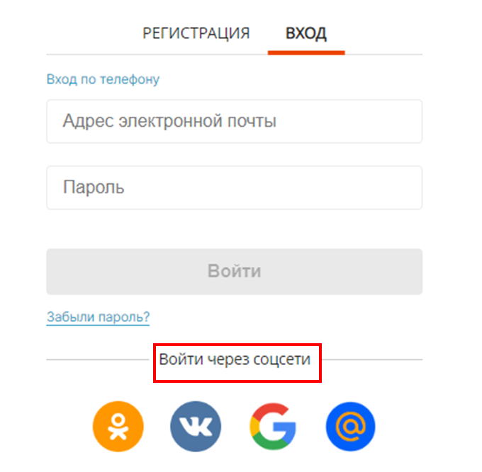
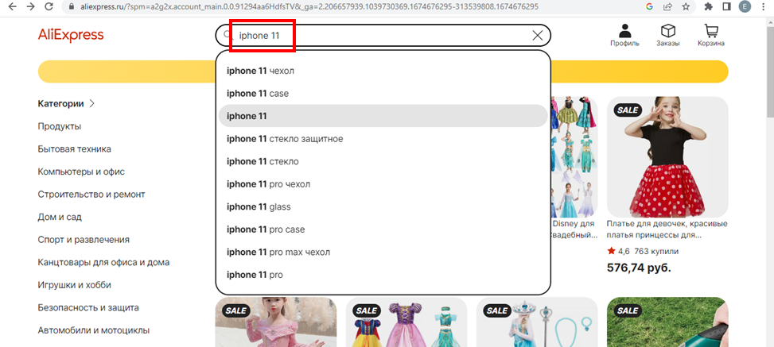
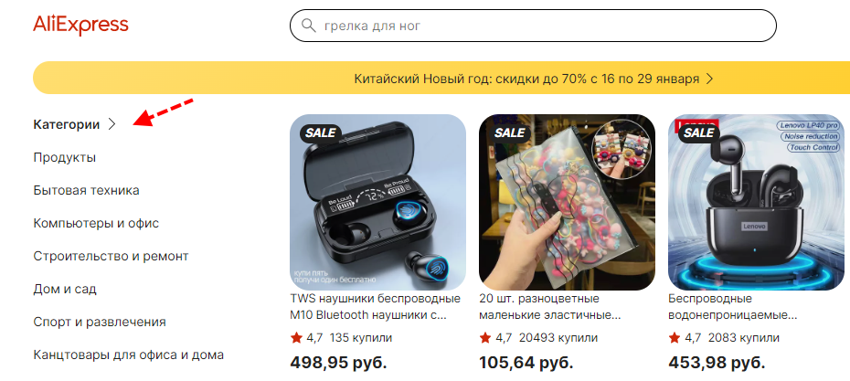
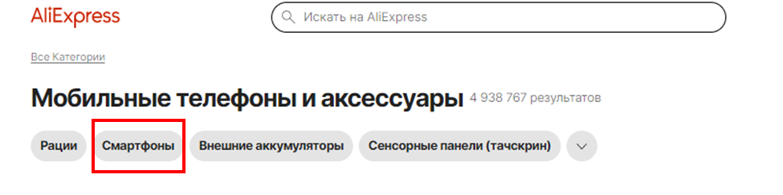
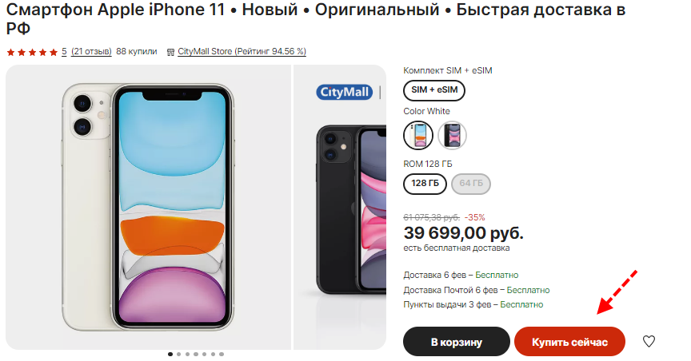
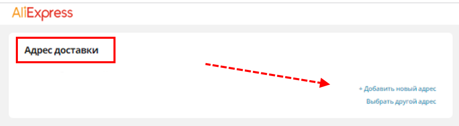
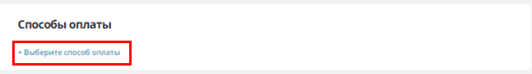
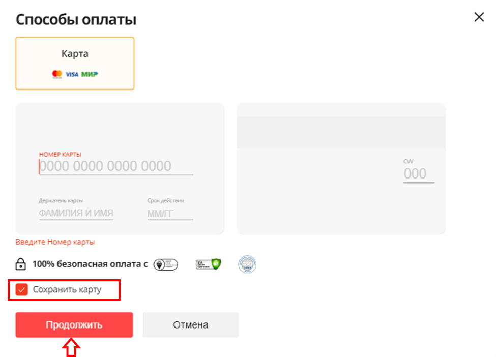
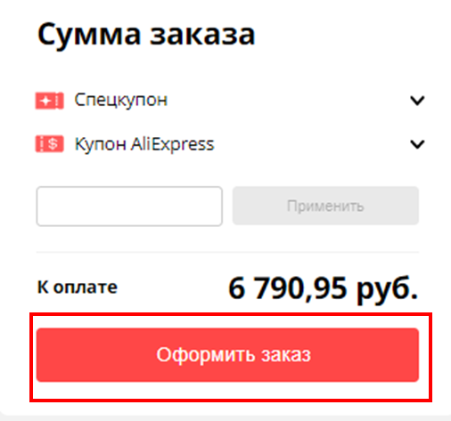

How to Search for and Buy Products from AliExpress
=============
**Table of contents**

How to Search for and Buy Products from AliExpress	
Log in to your account	
Search for items	
Shipping details and payment methods	

## Log in to your account

1.	Open your web browser and go to www.aliexpress.ru. Click **Sign In** in the upper-right corner.

 
2.	Sign in using your phone number/email and password or click **Sign up** to create a new account.
> You can browse the catalogues without an account, however, AliExpress requires an account in order to complete your purchase.

For a different authorization method, select **Sign in via social networks.**

 

## Search for items

3.	Once there, type what you’re looking for into the search bar and click Enter. 

 
4.	The sidebar on the left represents a list of different filtering options to further refine your search, such as delivery terms, price range, product category.

 

5.	You can also search products by categories. Go to the left side of the homepage to see the **Categories** menu.

 
 
6.	 Click on any category to see several subcategories. 

 
 
Then click on the subcategory that applies most to what you’re looking for.

7.	Scroll down the screen until you find an item that you like. When you do, click on its name to view detailed information about it, including photos, description, specifications, shipping options, seller rating, customer reviews, and more.

## Shipping details and payment methods

8.	Then, click **Buy Now** to go to the checkout page if this is the only item that you want to buy right now. Click **Add to Cart** to add this item to your shopping cart and continue shopping.
 
  

9.	On the checkout page, you can view the estimated delivery date, select a payment method, shipping details, and enter a coupon code if available.

 

Check your shipping address before placing an order. 

  
 
 Then click **Choose payment method**.  
 
   
 
10. Enter your billing details to pay for your item. Enable the **Save card** checkbox to add the new card to your account, then apply a coupon (optionally) and click **Continue**.
   
    
   
11.	Click **Place an order** to complete. 

  
 
The placed orders will be listed in the **Orders** section of your profile.
 
