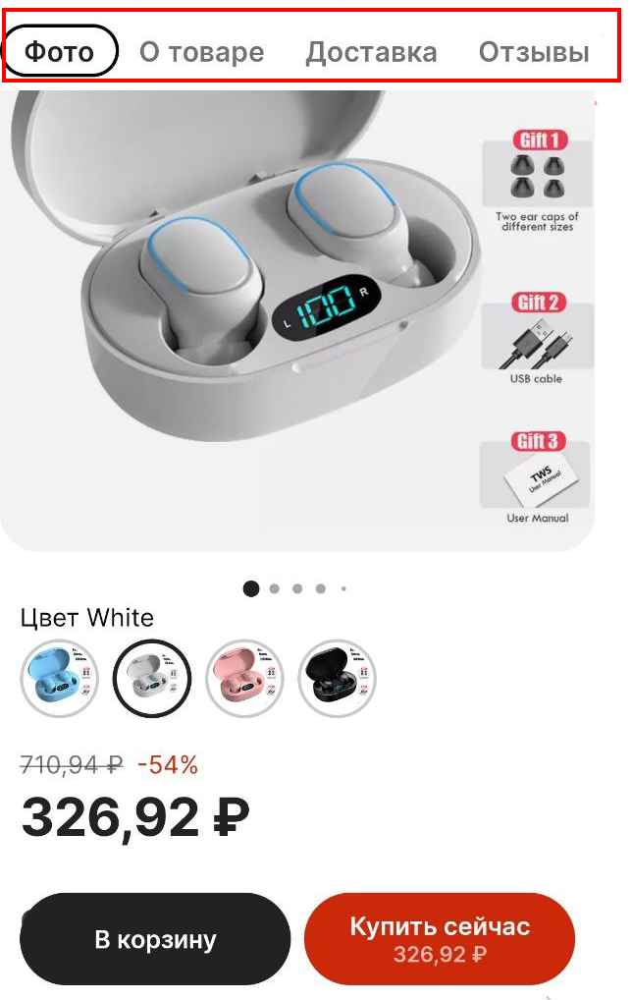

Как найти и купить товар через мобильное приложение AliExpress для Android
=============

**Содержание**

[Как найти и купить товар через мобильное приложение AliExpress для Android](#как-найти-и-купить-товар-через-мобильное-приложение-aliexpress-для-android)
[Загрузка приложения и авторизация](#загрузка-приложения-и-авторизация)
[Поиск товара](#поиск-товара)
[Оформление заказа и оплата](#оформление-заказа-и-оплата)

## Загрузка приложения и авторизация

1.	Загрузите мобильное приложение AliExpress из магазина приложений: GooglePlay и AppStore. Убедитесь, что это продукт от издателя Alibaba. Нажмите **Установить**, чтобы запустить установку.
 

2.	Авторизуйтесь в приложении под своим логином и паролем или создайте новую учетную запись. 
> Все каталоги и поиск товаров доступны без регистрации, однако для совершения покупки необходимо войти под своей учетной записью. 

Нажмите **Войти** в правом верхнем углу. 
 
Введите номер телефона, чтобы войти существующую учетную запись или создать новую учетную запись AliExpress. Для выбора другого метода авторизации выберите **Войти другим способом**.

  
  
Доступна авторизация по номеру телефона, через аккаунт Google, по электронной почте, а также через аккаунт в соцсетях ВКонтакте, Одноклассники, Mail.ru.
После авторизации можно приступить к поиску товара.

## Поиск товара

3.	Для поиска товара начните вводить ключевое слово в окне поиска. Введите наименование продукта полностью или выберите из предложенных вариантов поиска, затем нажмите значок поиска. 

   

Для более удобного поиска воспользуйтесь элементами сортировки, в частности, доступна сортировка по релевантности и популярности.

   
  
Нажмите на иконку фильтров, чтобы указать дополнительные параметры, такие как условия доставки, ценовой диапазон, категория товара.  

4.	Также можно воспользоваться поиском по категориям. Для этого нажмите **Категории** на панели снизу.
 
 
 
5.	Выберите категорию, которая наиболее точно соответствует критериям поиска. 
 
   
   
Кликните на товар, чтобы просмотреть подробную информацию о нем, в том числе фотографии, описание, характеристики, параметры доставки, рейтинг продавца, отзывы клиентов и т. д.

   

## Оформление заказа и оплата

6.	Добавьте товар в корзину или нажмите Купить сейчас, если Вы готовы завершить покупку.
7.	На странице оформления заказа можно ознакомиться с предполагаемой датой доставки, выбрать способ оплаты, проверить адрес доставки и ввести промокод при наличии.
Нажмите **Изменить адрес**, чтобы изменить адрес доставки при необходимости.

   
  
     
8.	Нажмите **Выбрать способ оплаты**, чтобы добавить новую карту для совершения операций. 

  
  
  Введите реквизиты карты и нажмите **Добавить**. 
> Выставите опцию **Сохранить карту**, чтобы новая карта была добавлена в Вашу учётную запись.
 
 
 
9.	Введите промокод (опционально) и нажмите **Оплатить** для завершения покупки. 

 
 
 После оплаты заказ будет отображаться в разделе **Заказы** в Вашем профиле.
